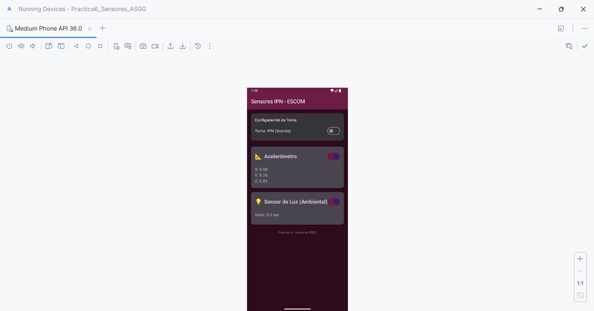

# Practica 6: Implementación de Sensores (IPN - ESCOM)

* **Nombre:** Ambar Stephania Garcia Gaspar
* **Boleta:** 2021630327
* **Grupo:** 7CV2
* **Materia:** Desarrollo de Aplicaciones Móviles Nativas

---

## 📱 Descripción del Proyecto
La aplicación es un monitor de sensores en tiempo real que implementa las siguientes características técnicas requeridas:

1.  **Lectura de Sensores:**
    * **Acelerómetro:** Muestra las coordenadas X, Y, Z en tiempo real.
    * **Sensor de Luz:** Muestra el valor en lux y una barra de progreso visual.
2.  **Gestión de Energía:**
    * Los sensores se desactivan automáticamente cuando la app pasa a segundo plano (`onPause`) para ahorrar batería.
    * Se envía una **Notificación** al usuario indicando que la app está en reposo.
3.  **Temas Personalizables:**
    * Switch para alternar entre **Tema Guinda (IPN)** y **Tema Azul (ESCOM)**.
    * Soporte automático para Modo Oscuro/Claro del sistema.
4.  **Control de Usuario:**
    * Interruptores (Switches) individuales para habilitar o deshabilitar la lectura de cada sensor.

---

## 🛠 Requisitos Técnicos
* **Lenguaje:** Kotlin
* **UI Framework:** Jetpack Compose (Material3)
* **SDK Mínimo:** API 24 (Android 7.0)
* **Paquete:** `com.example.practica6_sensores_asgg`

---

## 🚀 Guía de Ejecución y Pruebas

### 1. Ejecución en Dispositivo Físico
1.  Activa la *Depuración USB* en tu dispositivo.
2.  Conecta el celular y ejecuta la app desde Android Studio.
3.  Mueve el teléfono para ver los cambios en el acelerómetro o cubre el sensor frontal para variar la luz.

### 2. Ejecución en Emulador (Android Studio)
La app es funcional en el emulador utilizando las herramientas de **Sensores Virtuales**:

1.  Inicia la aplicación en el emulador.
2.  En la barra lateral del emulador, haz clic en los tres puntos **(...)** > **Virtual Sensors**.
3.  **Acelerómetro:** Pestaña *Device Pose*. Mueve el teléfono virtual para ver cambiar X, Y, Z.
4.  **Luz:** Pestaña *Additional Sensors*. Mueve el slider de "Light" para simular luz ambiental.

